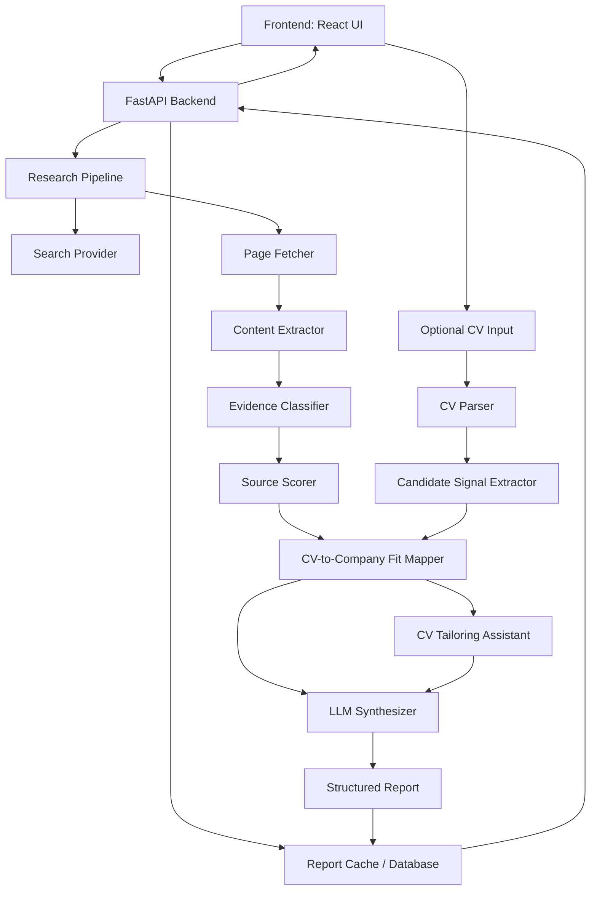

# Technical PRD: Company Research Agent

## 1. Product Summary

The product is an **API + frontend company research agent** for job seekers in Argentina. Users enter a company name, and the system investigates reliable public sources to generate a Spanish-language report with practical job-search and interview preparation insights.

The agent should help users understand:

- what the company does;
- company size and presence in Argentina;
- salary information;
- work culture;
- interview process;
- possible interview questions;
- CV-based personalized preparation;
- CV tailoring suggestions and optional adapted CV draft;
- current job openings;
- relevant risks, uncertainty, and source quality.

The system must prioritize **reliable, cited information** and avoid unsupported claims.

## 2. Target Users

Primary users:

- job seekers in Argentina;
- candidates preparing for interviews;
- people evaluating whether to apply to a company;
- career switchers researching companies across any industry.

The system is not limited to tech companies.

## 3. Language and Localization

The user-facing product must be in **Spanish**.

Primary locale:

- Argentina;
- Spanish tone: clear, practical, professional;
- avoid overly generic Latin American phrasing when local context matters.

Examples:

- "busquedas abiertas" instead of "job openings";
- "sueldo estimado" instead of "salary estimate";
- "proceso de entrevista";
- "presencia en Argentina".

## 4. Core User Flow

1. User enters a company name.
2. User optionally uploads or pastes a CV.
3. Frontend sends a research request to the backend.
4. Backend checks whether a recent saved report already exists.
5. If no valid report exists, backend starts a research pipeline.
6. System gathers evidence from reliable public sources.
7. Evidence is classified by topic.
8. If a CV is provided, backend extracts candidate signals and compares them against company and role evidence.
9. If requested, backend generates CV tailoring suggestions and an optional adapted CV draft.
10. Backend generates a structured Spanish report using deterministic evidence handling plus LLM synthesis.
11. Report is saved in the database.
12. Frontend displays the report with sections, citations, confidence indicators, CV-based preparation, CV tailoring guidance, and warnings.

## 5. MVP Features

### 5.1 Company Search Input

User can enter a company name.

Requirements:

- required company name;
- trim whitespace;
- handle ambiguous names with a warning where possible;
- support companies from any industry.

### 5.2 Research Report

The report must include:

1. **Resumen ejecutivo**
   - brief overview of the company;
   - what a candidate should know first.

2. **Negocio principal**
   - what the company does;
   - products/services;
   - business model if available.

3. **Presencia en Argentina**
   - offices, hiring activity, or market presence;
   - remote/hybrid signals if available.

4. **Cantidad de empleados**
   - approximate employee count;
   - source and confidence.

5. **Sueldos y beneficios**
   - salary ranges if available;
   - benefits if mentioned in sources;
   - explicit uncertainty when sources are weak.

6. **Cultura laboral**
   - employee reviews;
   - common positive/negative themes;
   - avoid overclaiming from a small number of reviews.

7. **Proceso de entrevista**
   - stages if available;
   - expected evaluation areas;
   - estimated difficulty if sourced.

8. **Posibles preguntas de entrevista**
   - generated from company role context and public interview evidence;
   - separated by general/company-specific/behavioral/technical if useful.

9. **Busquedas abiertas**
   - current job openings;
   - links to career pages or job platforms.

10. **Fuentes**
    - title;
    - URL;
    - source type;
    - confidence/reliability score;
    - accessed/generated date.

11. **Advertencias**
    - missing evidence;
    - old sources;
    - conflicting sources;
    - salary uncertainty;
    - possible company-name ambiguity.

### 5.3 CV-Based Personalized Preparation

User can optionally upload or paste a CV to receive personalized interview preparation.

Requirements:

- support pasted plain text in the first MVP;
- optionally support PDF and DOCX uploads if file parsing is added;
- extract candidate signals such as experience, roles, industries, skills, tools, education, languages, seniority, and achievements;
- compare CV signals against company research, job openings, and likely interview expectations;
- generate personalized preparation in Spanish;
- avoid claiming that the candidate is a definite fit or non-fit;
- avoid making sensitive inferences not present in the CV;
- allow report generation without a CV.

Personalized output should include:

- **Fortalezas para destacar**: candidate strengths that appear relevant to the company or roles found.
- **Brechas o puntos a preparar**: areas the candidate may need to explain or study.
- **Pitch sugerido**: short Spanish introduction adapted to the company.
- **Preguntas probables personalizadas**: interview questions based on the CV and company context.
- **Respuestas recomendadas en formato STAR**: suggested structure for behavioral answers.
- **Preguntas para hacerle a la empresa**: questions the candidate can ask during the interview.
- **Alertas de evidencia**: where recommendations are based on weak company data or broad inference.

### 5.4 CV Tailoring Assistant

User can optionally ask the agent to adapt their CV to the company's expectations and discovered job signals.

Requirements:

- never overwrite the original CV;
- generate suggestions and, when requested, a separate adapted CV draft;
- preserve factual truth from the original CV;
- never invent experience, employers, education, certifications, metrics, tools, or dates;
- mark suggestions as `rewrite`, `reorder`, `emphasize`, or `add_only_if_true`;
- explain why each suggestion is relevant to the company or role evidence;
- cite company/job evidence where a suggestion depends on researched context;
- allow the user to ignore any suggestion;
- keep all output in Spanish.

Tailoring output should include:

- **Resumen de enfoque**: what the adapted CV should emphasize for this company.
- **Sugerencias de cambios**: specific edits with reasons.
- **Borrador adaptado opcional**: a revised CV draft that remains faithful to the original CV.
- **Advertencias**: missing role evidence, weak company evidence, or suggestions that require user confirmation.

## 6. Non-MVP / Later Features

Not included in the first implementation:

- user accounts;
- saved candidate profiles;
- automatic company comparison;
- email alerts;
- scheduled report refreshes;
- scraping behind logins;
- browser automation for protected pages;
- paid-source integrations unless explicitly added later.

## 7. Recommended Tech Stack

### Backend

- **Python**
- **FastAPI**
- **Pydantic**
- **SQLAlchemy** or **SQLModel**
- **Alembic**
- **httpx**
- **BeautifulSoup** or **trafilatura**
- **pypdf** or **PyMuPDF** for PDF CV extraction if uploads are included
- **python-docx** for DOCX CV extraction if uploads are included
- **pytest**

### Frontend

- **React**
- **TypeScript**
- **Vite**
- Spanish-first UI
- Responsive layout for mobile, tablet, and desktop
- CSS modules, plain CSS, or Tailwind depending on design preference

### Database

MVP:

- **SQLite**

Future production:

- **PostgreSQL**

### Search Provider

Use one of:

- Tavily;
- SerpAPI;
- Bing Web Search API;
- Brave Search API.

Avoid relying only on raw scraping of search result pages.

### LLM

Use an LLM for synthesis only, not as a primary source of truth.

The LLM receives:

- normalized company name;
- evidence snippets;
- source metadata;
- optional structured CV profile;
- optional original CV text when generating a tailored CV draft;
- requested report schema;
- strict instruction to cite sources and avoid unsupported claims.

## 8. Architecture



## 9. Backend API

### `POST /api/research`

Starts or retrieves a company research report.

Request:

```json
{
  "company_name": "Mercado Libre",
  "force_refresh": false,
  "cv_text": "Texto opcional del CV del usuario",
  "include_cv_tailoring": false
}
```

Response:

```json
{
  "report_id": "uuid",
  "status": "completed",
  "company_name": "Mercado Libre",
  "generated_at": "2026-07-23T18:00:00Z",
  "report": {}
}
```

### `GET /api/reports/{report_id}`

Returns a saved report.

### `GET /api/companies/{company_id}/reports`

Returns previous reports for a company.

### `GET /api/reports`

Returns recent saved reports.

Useful for frontend history.

## 10. Data Model

### Company

Fields:

- `id`
- `name`
- `normalized_name`
- `created_at`

### Report

Fields:

- `id`
- `company_id`
- `status`
- `language`
- `generated_at`
- `summary`
- `sections_json`
- `warnings_json`
- `created_at`
- `updated_at`
- `cv_profile_json`
- `personalized_preparation_json`
- `cv_tailoring_json`

### Source

Fields:

- `id`
- `report_id`
- `title`
- `url`
- `domain`
- `source_type`
- `reliability_score`
- `accessed_at`
- `snippet`
- `section`

### Evidence

Fields:

- `id`
- `report_id`
- `source_id`
- `topic`
- `claim`
- `confidence_score`
- `raw_text_excerpt`

### CandidateProfile

Fields:

- `id`
- `report_id`
- `raw_cv_text`
- `roles_json`
- `skills_json`
- `industries_json`
- `experience_json`
- `education_json`
- `languages_json`
- `achievements_json`
- `created_at`

## 11. Research Pipeline

### Step 1: Normalize Company Name

Input:

- raw company name.

Output:

- cleaned company name;
- search-safe name;
- possible ambiguity warning.

### Step 2: Generate Search Queries

Query categories:

- official site;
- careers page;
- LinkedIn company page;
- employee count;
- salaries Argentina;
- reviews/culture;
- interview questions;
- job openings Argentina.

Example queries:

- `{company} sitio oficial`
- `{company} careers Argentina`
- `{company} LinkedIn employees`
- `{company} sueldos Argentina`
- `{company} entrevista preguntas`
- `{company} opiniones empleados`
- `{company} empleos Argentina`

### Step 3: Collect Search Results

The search provider returns:

- title;
- URL;
- snippet;
- rank;
- domain.

### Step 4: Fetch and Extract Content

For each selected URL:

- fetch page;
- extract readable text;
- remove navigation/footer noise;
- cap content size;
- store snippet and metadata.

### Step 5: Classify Evidence

Classify content into topics:

- business;
- employees;
- salary;
- culture;
- interviews;
- jobs;
- Argentina presence;
- general.

### Step 6: Score Reliability

Score from 1 to 5.

Higher score for:

- official company site;
- career page;
- LinkedIn company page;
- recognized job platforms;
- reputable salary/review platforms;
- recent pages;
- direct evidence.

Lower score for:

- unknown blogs;
- stale pages;
- duplicated snippets;
- indirect claims;
- pages with unclear authorship.

### Step 7: Generate Report

Use hybrid synthesis.

Deterministic code handles:

- source collection;
- evidence classification;
- source scoring;
- missing-data detection;
- citation mapping.

LLM handles:

- Spanish narrative;
- candidate-oriented insights;
- interview question generation;
- uncertainty explanation.

### Step 8: Generate CV-Based Preparation

Use a structured CV-to-company fit framework.

Inputs:

- structured CV profile;
- company research evidence;
- current job openings;
- interview process evidence;
- salary and culture evidence where available.

Framework:

1. **Extract candidate signals**
   - roles;
   - seniority;
   - industries;
   - hard skills;
   - soft skills;
   - tools;
   - achievements;
   - education;
   - languages.

2. **Map signals to company context**
   - match candidate experience to company business;
   - match skills to open roles or likely role families;
   - identify relevant industry overlap;
   - identify missing or weakly supported areas.

3. **Prepare interview strategy**
   - strengths to emphasize;
   - gaps to prepare;
   - tailored pitch;
   - likely questions;
   - STAR answer outlines;
   - questions to ask the interviewer.

4. **Add confidence and caveats**
   - distinguish evidence-backed guidance from inference;
   - warn when job-opening evidence is missing;
   - warn when the CV lacks enough detail.

### Step 9: Generate CV Tailoring Suggestions

Use a separate CV tailoring framework.

Inputs:

- original CV text or parsed CV structure;
- structured CV profile;
- company research evidence;
- current job openings when available;
- culture and interview evidence where relevant.

Framework:

1. **Identify relevant positioning**
   - role families or business areas the CV appears closest to;
   - skills, achievements, and industries worth emphasizing;
   - terms used in job openings or company materials.

2. **Generate safe edit suggestions**
   - rewrite existing bullets for clarity and relevance;
   - reorder sections or bullets;
   - emphasize relevant skills already present;
   - suggest additions only with `add_only_if_true`.

3. **Generate optional adapted CV draft**
   - preserve the original facts;
   - keep uncertain additions out of the draft;
   - include only truthful rewrites of existing content;
   - keep the original CV separate from the adapted draft.

4. **Add warnings**
   - warn when no relevant job opening was found;
   - warn when a suggestion depends on weak evidence;
   - warn when the CV lacks enough detail to tailor safely.

## 12. Frontend Requirements

### Main View

Components:

- company search input;
- submit button;
- loading/research status;
- optional CV paste/upload input;
- optional CV tailoring toggle;
- report view;
- source list;
- saved reports/history.

Layout requirements:

- mobile-first responsive design;
- usable on phones, tablets, and desktop screens;
- company search and CV input must remain easy to use on narrow screens;
- report sections must stack vertically on mobile;
- source lists and long URLs must wrap without horizontal overflow;
- desktop layout may use wider multi-column presentation where it improves readability.

### Report UI Sections

Display:

- overview;
- business;
- Argentina presence;
- employees;
- salaries;
- culture;
- interview process;
- possible questions;
- personalized preparation from CV;
- CV tailoring suggestions and optional adapted CV draft;
- open roles;
- warnings;
- sources.

Each claim should show either:

- citation marker;
- confidence indicator;
- or "sin evidencia suficiente".

## 13. Quality Rules

The system must not:

- invent exact employee numbers;
- invent salaries;
- claim job openings without current source evidence;
- use LLM knowledge as a source;
- hide uncertainty;
- summarize anonymous reviews as universal truth.
- expose uploaded CV text beyond the generated report context;
- make sensitive inferences from the CV.
- modify the original CV without explicit user action;
- invent or exaggerate CV facts.

The system should:

- cite sources;
- separate fact from inference;
- flag weak evidence;
- prefer recent and official sources;
- keep all output in Spanish.

## 14. Testing Strategy

Backend tests:

- company name normalization;
- query generation;
- source scoring;
- evidence classification;
- report persistence;
- report schema validation;
- CV text parsing;
- candidate signal extraction;
- CV-to-company fit mapping;
- CV tailoring suggestion validation;
- adapted CV draft truthfulness checks;
- handling no-source cases;
- handling conflicting-source cases.

Frontend tests later:

- report rendering;
- empty states;
- loading states;
- source display;
- CV input states;
- CV tailoring states;
- personalized preparation rendering;
- responsive behavior for mobile and desktop widths;
- Spanish copy.

Integration tests:

- mocked search provider;
- mocked LLM;
- full report generation pipeline.

## 15. MVP Success Criteria

The MVP is successful when:

- user can enter a company name from any industry;
- backend generates a saved Spanish report;
- report includes structured sections;
- optional CV input generates personalized preparation;
- optional CV tailoring generates safe suggestions without modifying the original CV;
- each factual claim is tied to sources where possible;
- weak or missing evidence is clearly marked;
- frontend can display saved reports;
- frontend is responsive across mobile, tablet, and desktop layouts;
- core pipeline is covered by tests with mocked external services.

