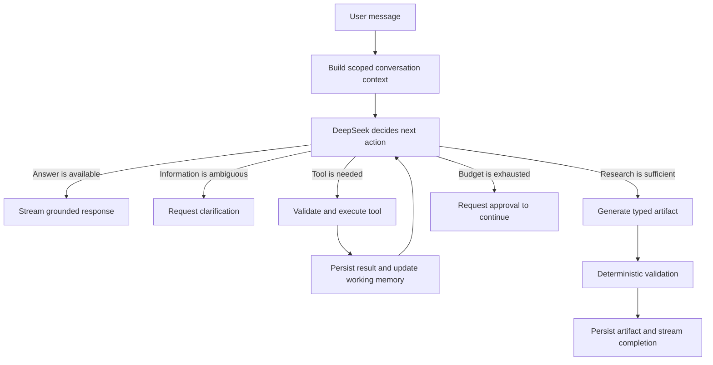

# Technical PRD: Radar Laboral Conversational Agent

## 1. Product Summary

Radar Laboral is a local, Spanish-first conversational career assistant for job seekers in Argentina. The primary product surface is a persistent chat where the user can ask questions, research companies, compare employers, prepare for interviews, analyze job descriptions, and receive CV recommendations.

The assistant is not limited to generating company reports. For every user message, DeepSeek decides whether to:

- answer directly;
- retrieve information from previous conversations or saved reports;
- ask for clarification;
- call one or more controlled tools;
- start or continue a longer-running task;
- request approval or review when human involvement is required.

The product combines model-directed research with deterministic evidence safeguards. DeepSeek controls the research strategy and chooses when to use tools, while backend code controls tool execution, source scoring, evidence identifiers, budgets, persistence, citation validation, CV truthfulness, and final report validation.

The application is intended for local, personal, single-user use. It does not require authentication or user accounts.

## 2. Product Goals

Radar Laboral should let the user:

- interact naturally instead of navigating a report-generation form;
- continue a topic across multiple messages;
- generate and discuss evidence-backed company reports;
- compare companies using stored and newly researched evidence;
- ask follow-up questions without repeating context;
- store one or more CVs locally and reuse them in future conversations;
- attach a new CV or job description directly from the chat composer;
- review and safely edit CV recommendations without overwriting the original;
- understand what the agent is doing during longer tasks;
- distinguish sourced facts, inferences, recommendations, uncertainty, and missing evidence.

Success means the chatbot chooses appropriate actions, preserves conversational context, produces auditable outputs, and clearly involves the user when a decision or approval is necessary.

## 3. Target User and Operating Context

Primary user:

- a job seeker in Argentina;
- evaluating companies or vacancies across any industry;
- preparing applications and interviews;
- working locally on a personal computer;
- often operating with limited time and incomplete public information.

Operating assumptions:

- one trusted local user;
- no login, account, organization, or tenant boundary;
- SQLite is the local database;
- uploaded CV files are stored in an application-managed local directory;
- external access is limited to configured providers such as DeepSeek, Google embeddings, and Tavily;
- user-facing content is in practical Argentine Spanish.

## 4. Product Principles

### 4.1 Conversation First

The conversation is the primary interface. Reports, comparisons, CV recommendations, warnings, approvals, and research progress appear as messages or inline artifacts in the transcript.

### 4.2 Evidence Before Advice

Company facts must be grounded in retained public evidence. The interface must keep sources, confidence, freshness, uncertainty, and missing evidence visible.

### 4.3 Autonomous but Bounded

DeepSeek may decide what to search, which source to inspect, which evidence gap to pursue, and when to stop. The backend enforces tool permissions, budgets, timeouts, URL restrictions, validation, and persistence.

### 4.4 Human Control at Consequential Moments

Routine public research should not require confirmation. The system should pause for clarification, approval, or review only when the user's decision materially changes the result or authorizes a consequential action.

### 4.5 CV Truthfulness and Reversibility

The assistant must never invent CV facts or silently overwrite an original CV. Uploaded files are versioned, extracted content is editable, and generated adaptations remain separate drafts until the user reviews them.

### 4.6 Local-First Privacy

Conversations, CV metadata, extracted CV content, reports, and agent execution history remain local except for the minimum context sent to configured external providers. Raw CV content must not appear in logs or report embeddings.

## 5. Core Conversational Behaviors

### 5.1 Direct Response

DeepSeek should answer without tools when the request:

- is conversational or explanatory;
- can be answered from the current conversation context;
- can be answered from already retrieved, sufficiently current evidence;
- does not require an external action or new research.

Direct factual answers about companies must cite stored report evidence when available. If the evidence is insufficient, DeepSeek must say so rather than rely on unsourced model knowledge.

### 5.2 Clarification

DeepSeek should ask a focused clarification when different interpretations would materially change the result, including:

- ambiguous company identity;
- unclear comparison scope;
- multiple stored CVs with no selected default;
- several possible job descriptions or reports;
- missing information required for a safe CV recommendation.

The task is persisted with `needs_clarification` status and resumes after the user replies.

### 5.3 Autonomous Task Execution

DeepSeek may start a bounded task when the request requires:

- researching a company;
- refreshing stale or incomplete evidence;
- comparing two or more companies;
- analyzing a job description;
- matching a CV to a company or vacancy;
- generating interview preparation;
- producing CV tailoring suggestions or a separate adapted draft.

The central conversation must show incremental progress while the task runs.

### 5.4 Human Approval and Review

Human involvement has three distinct forms:

1. `needs_clarification`: required information or intent is ambiguous.
2. `awaiting_approval`: the agent understands the action but needs permission.
3. `awaiting_review`: the agent has produced a draft that the user should verify.

Approval is required before:

- extending an exhausted standard research budget;
- deleting conversations, reports, stored CVs, or CV versions when deletion is initiated by the agent;
- any future external communication, publication, submission, or paid action.

Review is required for:

- CV tailoring suggestions;
- adapted CV drafts;
- additions marked `add_only_if_true`;
- personalized career statements that require the user to confirm accuracy.

Authentication-free local UI actions explicitly initiated by the user, such as pressing a visible delete button and confirming the dialog, do not need a separate agent approval turn.

## 6. Agent Architecture

### 6.1 Model and SDK

The initial agent uses:

- the existing `httpx` client for DeepSeek's OpenAI-compatible Chat Completions API;
- model `deepseek-v4-flash` in non-thinking mode;
- DeepSeek tool calls for intermediate actions;
- JSON output plus Pydantic validation for final reports and typed artifacts;
- Google Gen AI only for `gemini-embedding-2` embeddings.

DeepSeek V4 Flash supports tool calls and JSON output according to the [official API documentation](https://api-docs.deepseek.com/api/create-chat-completion/). Thinking is explicitly disabled so the backend-controlled loop never stores private reasoning content.

The model remains configurable through environment settings, but any replacement must support function calling and structured output.

### 6.2 Single-Agent Decision Loop

The first implementation uses one agent, not a multi-agent system.



For each loop iteration, the backend must:

1. provide only the context relevant to the active conversation and task;
2. expose the allowed tools and their typed schemas;
3. validate the requested tool and arguments;
4. execute the tool in application code;
5. persist a concise event and resulting artifact references;
6. return the tool result to DeepSeek;
7. stop on a final response, pause state, failure, cancellation, or hard budget.

Private chain-of-thought must not be requested, exposed, or stored. The system may retain concise user-visible action summaries and provider-required opaque thought signatures while a model interaction is active.

### 6.3 Agent Tools

The initial controlled tool set includes:

#### `search_web`

- Purpose: search public web sources using a model-generated query.
- Provider: `TavilySearchProvider`.
- Inputs: query, intended evidence topic, result limit.
- Output: normalized source IDs, titles, URLs, snippets, domains, ranks, and source types.
- Rules: queries are deduplicated; result limits and budgets are enforced by the backend.

#### `inspect_page`

- Purpose: extract and classify evidence from a selected search result.
- Input: a source ID returned by `search_web`.
- Output: evidence IDs, updated topics, concise extracted summary, and extraction warnings.
- Rules: no unrestricted arbitrary URL fetch; allowed schemes, content size, timeouts, and protected-domain behavior are enforced by the backend.

#### `review_evidence`

- Purpose: show deterministic topic coverage and unresolved gaps.
- Output: coverage by topic, strong/weak evidence counts, stale evidence, conflicts, and missing topics.
- Rules: DeepSeek may use the result for planning but may not assign or override reliability scores.

#### `finish_research`

- Purpose: let DeepSeek declare that further research is unlikely to improve the result.
- Inputs: stopping reason and unresolved topics.
- Rules: the backend may reject premature completion when minimum requirements are unmet and budget remains.

#### `retrieve_reports`

- Purpose: locate previous reports and relevant evidence by company, topic, freshness, or conversation context.
- Output: report IDs, company names, freshness, relevant chunks, evidence IDs, and citations.

#### `compare_reports`

- Purpose: assemble normalized evidence for a comparison requested by the user.
- Inputs: report IDs and comparison dimensions.
- Output: side-by-side evidence, confidence, freshness, conflicts, and missing dimensions.
- Rules: comparisons remain grounded in cited evidence; missing dimensions are explicit.

#### `get_cv_profile`

- Purpose: retrieve the selected or default stored CV's editable content and structured signals.
- Rules: if several CVs exist and none is selected or default, pause for clarification.

#### `analyze_job_description`

- Purpose: extract role, seniority, responsibilities, required skills, preferred skills, languages, and keywords from a provided job description.

#### `prepare_cv_recommendations`

- Purpose: generate evidence-linked CV positioning and tailoring suggestions from the CV, job description, and relevant company evidence.
- Rules: outputs are drafts requiring review; `add_only_if_true` content is excluded from adapted drafts until confirmed.

Tools for database deletion, arbitrary filesystem access, arbitrary HTTP requests, shell execution, email, applications, or external publication are not exposed to DeepSeek in the initial version.

### 6.4 Budgets and Stopping

Agent budgets are configurable and enforced server-side. They cover:

- model turns;
- web searches;
- page inspections;
- elapsed task time;
- provider timeouts;
- extracted content size.

DeepSeek cannot increase its own budget. When the standard budget is exhausted and meaningful gaps remain, the task changes to `awaiting_approval` and offers one explicit option to continue with an extended budget. Repeated searches or inspections that produce no new evidence count toward the stopping decision.

## 7. Memory Model

The product requires several scoped memory types. A vector index alone is not the complete memory system.

### 7.1 Conversation Memory

Each conversation retains:

- recent messages;
- a compact summary of older messages;
- cited artifacts and reports;
- unresolved clarifications;
- the current conversational objective.

The context builder sends recent messages plus a summary instead of replaying unlimited history.

### 7.2 Active-Context Memory

Each conversation stores explicit references to:

- active company IDs;
- active report IDs;
- selected CV ID;
- selected job-description artifact;
- active task run;
- pending clarification, approval, or review.

This resolves references such as “that company,” “the previous report,” or “use my CV.”

### 7.3 Task Working Memory

Every running task stores structured state including:

- task type and goal;
- completed steps;
- tool budgets and usage;
- searches and pages already inspected;
- collected source and evidence IDs;
- coverage and unresolved gaps;
- stopping or pause reason.

Task state is persisted after meaningful events so interrupted tasks can be diagnosed and later resumed safely.

### 7.4 Artifact and Evidence Memory

Durable artifacts include:

- company reports;
- comparisons;
- job descriptions;
- stored CVs and CV versions;
- CV recommendations and adapted drafts;
- sources, evidence, claims, warnings, and citations.

Existing report evidence remains the factual source of truth.

### 7.5 Semantic Retrieval Memory

Google Gemini embeddings and local SQLite similarity search retrieve relevant report chunks for follow-up and comparative questions. DeepSeek receives only the selected chunks for answer generation. Retrieval must be scoped to the active conversation, explicitly selected artifacts, or permitted historical reports.

Raw CV text and CV-derived personal content must not be placed in the general report embedding index.

### 7.6 Execution Memory

The system stores a concise event trace containing:

- task state transitions;
- tool name and validated arguments;
- debug-safe result summaries and artifact IDs;
- timestamps, duration, and budget usage;
- failures, retries, approvals, and stopping reasons.

Execution memory supports observability and replay without storing private chain-of-thought or raw CV text in logs.

### 7.7 Long-Term User Memory

There is no multi-user profile or cross-device account memory. Local app settings may store a default CV and interface preferences for the single local user.

## 8. Local CV Library

### 8.1 Storage

The user can upload PDF and DOCX CVs from:

- the sidebar CV library;
- the chat composer's `+` menu.

On upload, the application automatically:

1. validates the type and size;
2. saves the original file in an application-managed local directory;
3. extracts editable text;
4. creates structured candidate signals;
5. creates a CV version record in SQLite;
6. makes the CV available to future conversations.

SQLite stores metadata, extracted editable content, structured signals, versions, and default selection. The binary file remains on the local filesystem and is addressed through a generated storage key, never a user-controlled path.

### 8.2 CV Management

From the sidebar, the user can:

- list stored CVs;
- open the original file;
- view and edit extracted text;
- rename a CV;
- upload a replacement version;
- inspect version history;
- select one CV as the default;
- delete a CV or a specific version after confirmation.

Replacing a file creates a new version and does not silently overwrite the original. Editing extracted text also creates a new logical version or revision entry.

If exactly one CV exists, it may become the default automatically. If several CVs exist and none is default or explicitly attached, DeepSeek must ask which CV to use for CV-related tasks.

### 8.3 CV Safety

The system must:

- never invent employers, dates, education, certifications, skills, tools, metrics, or achievements;
- distinguish original text from proposed text;
- retain evidence lines from the CV for verification;
- mark unconfirmed additions as `add_only_if_true`;
- never include unconfirmed additions in an adapted draft;
- keep adapted drafts separate from every stored original version;
- allow the user to accept, reject, or edit individual recommendations;
- avoid sensitive inferences not explicitly present in the CV.

## 9. Company Research and Reports

### 9.1 Research Topics

Company research may cover:

- executive overview;
- core business, products, services, and business model;
- presence in Argentina;
- employee count;
- salaries and benefits;
- culture and employee-review themes;
- interview process and possible questions;
- current open roles;
- company-specific risks, conflicts, and uncertainty.

The agent may adapt its search plan to the user's request instead of always researching every topic. A full company-report request should attempt all standard topics. A narrow follow-up should research only the necessary gaps.

### 9.2 Evidence Handling

Deterministic code continues to handle:

- source normalization and deduplication;
- source-type classification;
- reliability scoring;
- evidence IDs and topic classification;
- freshness and missing-data detection;
- citation mapping;
- unsupported-number detection;
- supporting-quote validation;
- report schema validation;
- source and evidence persistence.

DeepSeek may choose what to investigate and synthesize, but it may not treat its own knowledge as a source or weaken validation rules.

### 9.3 Report Artifacts

A completed report remains a structured, persistent artifact. In the conversation it appears inline with:

- readable sections;
- claim confidence;
- citations and source links;
- warnings and missing evidence;
- generation and freshness dates;
- controls to expand details, ask a follow-up, compare, or refresh.

Existing reports created by the current application remain readable. They are exposed as historical artifacts that new conversations can open, cite, compare, or refresh.

## 10. Company Comparisons

The user may compare companies conversationally without first opening a separate screen.

The comparison flow must:

- resolve the companies and requested dimensions;
- retrieve relevant current reports;
- disclose stale or missing reports;
- ask whether to refresh when stale evidence could materially affect the result;
- research missing information when the user requests it;
- present an inline side-by-side artifact;
- cite the underlying evidence for each company;
- avoid ranking companies when the criteria or evidence are insufficient.

## 11. Frontend Experience

### 11.1 Design Direction

The selected direction is **Option B: Evidence-First Assistant**.

The interface is:

- light mode only in the initial version;
- restrained, calm, precise, and text-led;
- inspired by modern AI chat interfaces such as ChatGPT and Claude without copying their branding;
- designed around evidence visibility and human-in-the-loop tasks;
- implemented with the existing plain HTML, CSS, and JavaScript frontend.

Design tokens should make a future dark theme possible, but dark mode is out of scope.

### 11.2 Desktop Layout

The app uses two primary regions:

#### Sidebar

- Radar Laboral identity;
- `Nuevo chat` action;
- conversation search;
- conversation history grouped by recency;
- selected-conversation state;
- local CV library with view/edit/default status;
- settings entry;
- conversation rename and delete actions.

#### Central Conversation

- conversation title and task status;
- user and assistant messages;
- streamed agent responses;
- research progress and tool summaries;
- inline reports and comparisons;
- source citations and uncertainty warnings;
- clarification, approval, and review controls;
- sticky multiline composer.

The transcript should use an open, readable layout rather than placing every message inside a heavy card or colored bubble.

### 11.3 Composer

The composer includes:

- multiline message input;
- send/cancel control;
- `+` attachment and action menu;
- visible attached-context chips;
- keyboard submission with an accessible multiline alternative.

The `+` menu supports:

- attach the default or another stored CV;
- upload a new CV, which is stored automatically;
- attach or paste a job description;
- attach an existing company report when useful.

There is no permanent company-research or CV form. The user requests work through natural language and attachments.

### 11.4 Inline States and Artifacts

The conversation must render:

- agent typing/streaming state;
- task queued, running, paused, completed, cancelled, and failed states;
- tool-progress summaries without private reasoning;
- report and comparison artifacts;
- clarification prompts;
- approval prompts with exact proposed action and impact;
- CV review suggestions with accept, reject, and edit controls;
- source links, confidence, warnings, and freshness;
- retry and resume actions after recoverable failures.

### 11.5 Empty State

A new conversation should teach the interaction model with concise examples such as:

- “Investigá Mercado Libre para una entrevista junior.”
- “Compará Globant y Accenture para roles de datos.”
- “Usá mi CV y esta oferta para sugerirme mejoras.”

The empty state must not resemble a marketing landing page or delay access to the composer.

### 11.6 Responsive Behavior

On tablet and mobile:

- the sidebar becomes an accessible drawer;
- the central conversation uses the full viewport width;
- the composer remains reachable above the software keyboard;
- inline comparisons become stacked sections when a table would overflow;
- long source URLs wrap safely;
- touch targets remain at least 44 by 44 CSS pixels;
- focus order and drawer dismissal work by keyboard and assistive technology.

### 11.7 Accessibility

The frontend must provide:

- WCAG AA text and control contrast;
- visible focus states;
- semantic landmarks and headings;
- keyboard navigation;
- `aria-live` announcements for meaningful streamed status changes without announcing every token;
- reduced-motion behavior;
- accessible labels for icon-only controls;
- readable line lengths of approximately 65 to 75 characters for prose;
- non-color indicators for confidence, errors, warnings, and selection.

## 12. Streaming and Task Lifecycle

### 12.1 Server-Sent Events

SSE is the primary mechanism for delivering agent output and task progress. Events are persisted before or as they are emitted so reconnecting clients can request events after the last received event ID.

Core event types:

- `message.started`;
- `message.delta`;
- `message.completed`;
- `task.started`;
- `task.progress`;
- `tool.started`;
- `tool.completed`;
- `artifact.created`;
- `clarification.required`;
- `approval.required`;
- `review.required`;
- `task.completed`;
- `task.cancelled`;
- `task.failed`;
- `heartbeat`.

Tool events expose a safe action label and result summary, not raw provider payloads, private reasoning, secrets, or raw CV content.

### 12.2 Task Statuses

Task runs use:

- `pending`;
- `running`;
- `needs_clarification`;
- `awaiting_approval`;
- `awaiting_review`;
- `completed`;
- `cancelled`;
- `failed`.

The user can cancel a running task. A paused task retains its working state and resumes only from a valid user response.

### 12.3 Reconnection and Recovery

If the SSE connection closes:

- the task continues unless explicitly cancelled;
- the UI reconnects with the last received event ID;
- already persisted events are replayed without duplicating messages or artifacts;
- the final state is always retrievable with normal REST endpoints.

## 13. Backend API

Base path: `/api`.

All user-facing error messages are in Spanish. IDs are opaque strings. Timestamps use ISO 8601 UTC. Raw CV text is returned only by explicit CV-management endpoints and never through general conversation or report-list responses.

### 13.1 Conversations

#### `POST /api/conversations`

Creates an empty conversation.

Request:

```json
{
  "title": null
}
```

Response: `201 Created`

```json
{
  "conversation_id": "conv_123",
  "title": "Nueva conversación",
  "created_at": "2026-08-14T00:00:00Z"
}
```

The title may be generated after the first substantive user message.

#### `GET /api/conversations`

Returns paginated conversation summaries for the sidebar. Supports text search and excludes full message bodies.

#### `GET /api/conversations/{conversation_id}`

Returns conversation metadata, active context, messages, inline artifact references, and current task state.

#### `PATCH /api/conversations/{conversation_id}`

Renames a conversation or updates explicit active-context selections.

#### `DELETE /api/conversations/{conversation_id}`

Deletes the conversation and its messages/task events after explicit UI confirmation. Referenced reports and CVs are not deleted automatically.

### 13.2 Messages and Events

#### `POST /api/conversations/{conversation_id}/messages`

Persists a user message and starts agent handling.

Request:

```json
{
  "content": "Compará Mercado Libre y Globant para un rol junior de datos.",
  "attachments": [
    {
      "type": "cv",
      "artifact_id": "cv_123"
    }
  ]
}
```

Response: `202 Accepted`

```json
{
  "message_id": "msg_123",
  "task_run_id": "task_123",
  "status": "pending",
  "events_url": "/api/conversations/conv_123/events"
}
```

#### `GET /api/conversations/{conversation_id}/events`

Opens an SSE stream. The client may send `Last-Event-ID` to resume after disconnection.

#### `POST /api/task-runs/{task_run_id}/resume`

Resumes a paused task with a clarification, approval, rejection, review decision, or budget-extension decision.

Request:

```json
{
  "response_type": "approval",
  "decision": "approved",
  "content": null,
  "selected_option_ids": []
}
```

#### `POST /api/task-runs/{task_run_id}/cancel`

Cancels a pending or running task and emits `task.cancelled`.

### 13.3 CV Library

#### `POST /api/cvs`

Uploads and stores a PDF or DOCX using `multipart/form-data`. Creates the CV and its first version, extracts editable text, and returns metadata and processing status.

#### `GET /api/cvs`

Lists stored CVs for the sidebar, including name, current version, update time, and default status. It does not include complete extracted text.

#### `GET /api/cvs/{cv_id}`

Returns CV metadata, editable extracted content, structured signals, and version summaries.

#### `PATCH /api/cvs/{cv_id}`

Updates the display name, editable extracted content, or default selection. Editing extracted content creates a revision; setting one CV as default clears the previous default atomically.

#### `POST /api/cvs/{cv_id}/versions`

Uploads a replacement PDF/DOCX as a new version without overwriting earlier versions.

#### `GET /api/cvs/{cv_id}/versions/{version_id}/file`

Returns the locally stored original file for viewing or download.

#### `DELETE /api/cvs/{cv_id}`

Deletes the CV, its versions, managed local files, and derived profiles after confirmation. Existing reports retain their historical generated text but lose direct CV-library links.

### 13.4 Existing Report Compatibility

The following existing capabilities remain available during and after migration:

- `POST /api/research`;
- `GET /api/reports/{report_id}`;
- `GET /api/reports`;
- `GET /api/companies/{company_id}/reports`;
- `POST /api/reports/{report_id}/chat`;
- `POST /api/chat`;
- `POST /api/rag/reindex`;
- existing report and CV-data deletion endpoints.

The redesigned frontend uses conversation APIs as its primary interface. Legacy chat and research endpoints remain compatibility paths and internal building blocks until a later explicit deprecation decision.

## 14. Persistence Model

### 14.1 New Conversation Entities

#### `conversations`

- `id`;
- `title`;
- `summary`;
- `active_context_json`;
- `created_at`;
- `updated_at`;
- `archived_at` nullable.

#### `conversation_messages`

- `id`;
- `conversation_id`;
- `role`: `user`, `assistant`, or `system_event`;
- `content`;
- `status`;
- `citations_json`;
- `created_at`;
- `completed_at` nullable.

#### `conversation_artifacts`

- `id`;
- `conversation_id`;
- `message_id` nullable;
- `artifact_type`;
- `artifact_id`;
- `relationship_type`;
- `created_at`.

This table links conversations to reports, comparisons, CVs, job descriptions, and generated drafts without duplicating those objects.

### 14.2 Task Entities

#### `task_runs`

- `id`;
- `conversation_id`;
- `trigger_message_id`;
- `task_type`;
- `status`;
- `working_state_json`;
- `budget_json`;
- `usage_json`;
- `pause_reason_json` nullable;
- `stopping_reason` nullable;
- `created_at`;
- `updated_at`;
- `completed_at` nullable.

#### `task_events`

- `id` with stable SSE ordering;
- `task_run_id`;
- `conversation_id`;
- `event_type`;
- `tool_name` nullable;
- `arguments_json` nullable and sanitized;
- `result_summary_json` nullable;
- `artifact_refs_json`;
- `created_at`.

### 14.3 CV Entities

#### `stored_cvs`

- `id`;
- `display_name`;
- `is_default`;
- `current_version_id`;
- `created_at`;
- `updated_at`.

#### `cv_versions`

- `id`;
- `cv_id`;
- `version_number`;
- `storage_key`;
- `original_filename`;
- `content_type`;
- `file_size`;
- `file_hash`;
- `extracted_text`;
- `structured_profile_json`;
- `created_from`: `upload`, `replacement`, or `text_edit`;
- `created_at`.

The database never stores user-supplied absolute filesystem paths. The storage service resolves generated storage keys inside one configured CV directory.

### 14.4 Retained Entities

Existing entities remain authoritative for completed research:

- companies;
- reports;
- report sections;
- claims;
- sources;
- evidence items;
- claim-evidence links;
- report embedding chunks;
- personalized preparation;
- CV tailoring and suggestions.

Existing report-scoped candidate profiles remain readable. New CV work should reference `stored_cvs` and `cv_versions`, with optional snapshot links from reports to the exact CV version used.

### 14.5 JSON and Validation

SQLite stores structured JSON as text. Every JSON field must use a typed Pydantic schema before persistence. Empty arrays and objects use valid `[]` and `{}` defaults. Arbitrary unvalidated model output must not be stored as completed product data.

## 15. Privacy and Security

Even as a local single-user application, the system must:

- store CV files only under the configured managed directory;
- reject path traversal and unsupported file types;
- enforce file and extracted-text size limits;
- avoid logging raw CV text, job descriptions, secrets, or complete provider payloads;
- send CV content to DeepSeek only for an explicit CV-related request;
- keep CV content out of general report embeddings;
- never expose local filesystem paths through the API;
- validate all model-requested tool arguments;
- restrict page fetching to HTTP and HTTPS search results;
- preserve existing grounding and citation safeguards;
- allow the user to delete conversations, CVs, versions, and reports.

No multi-user isolation is claimed because authentication is intentionally out of scope.

## 16. Error Handling

Errors use stable machine-readable codes and practical Spanish messages.

Required scenarios include:

- DeepSeek unavailable or invalid tool call;
- Tavily unavailable or empty results;
- page extraction failure;
- unsupported or unsafe URL;
- agent budget exhausted;
- SSE disconnection;
- stale or missing report;
- ambiguous company or CV selection;
- missing managed CV file;
- invalid PDF/DOCX;
- invalid or ungrounded structured output;
- failed task resume;
- deleted artifact referenced by an older conversation.

A failed tool should not automatically fail the whole task when DeepSeek can use another source or produce a limited, clearly warned answer. Invalid final factual output must not be saved as completed.

## 17. Quality and Safety Rules

The system must not:

- invent sources, salaries, employee numbers, vacancies, benefits, interview stages, or company presence;
- treat DeepSeek's prior knowledge as evidence;
- hide stale, conflicting, or missing evidence;
- summarize a small number of anonymous reviews as universal truth;
- expose private chain-of-thought;
- allow DeepSeek to bypass budgets or validators;
- run arbitrary URLs or filesystem operations requested by the model;
- silently select among multiple non-default CVs;
- overwrite an original CV;
- invent or exaggerate candidate facts;
- include `add_only_if_true` suggestions in a draft without confirmation.

The system should:

- cite evidence IDs for factual claims;
- show source links and freshness;
- separate facts, inference, recommendations, and missing evidence;
- target reliable and current sources;
- use narrow follow-up research for specific questions;
- preserve a debug-safe task trace;
- make approval impact explicit;
- continue providing a limited answer when some topics remain unsupported;
- keep all user-facing output in Spanish.

## 18. Testing Strategy

### 18.1 Agent Routing and Tools

Test that DeepSeek-facing orchestration can:

- answer directly without tools when appropriate;
- retrieve a saved report for a grounded follow-up;
- select `search_web` for missing current information;
- inspect a chosen source and perform targeted follow-up research;
- stop when evidence is sufficient;
- pause when the budget is exhausted;
- reject unknown tools and invalid arguments;
- avoid repeating identical searches indefinitely.

Model behavior tests use scripted/fake model responses. They must not depend on nondeterministic live-provider decisions.

### 18.2 Memory and Conversations

Test:

- message persistence and ordering;
- conversation title generation and rename;
- active report/CV/job resolution;
- recent-message plus summary context construction;
- ambiguous references causing clarification;
- cross-conversation memory isolation;
- artifact deletion leaving safe historical placeholders;
- interrupted task state persistence and resume.

### 18.3 Streaming

Test:

- SSE event ordering and IDs;
- reconnect with `Last-Event-ID`;
- no duplicated messages or artifacts after replay;
- task completion after client disconnection;
- cancellation;
- safe event payloads without secrets or raw CV text.

### 18.4 Reports and Evidence

Retain and extend tests for:

- search-result normalization;
- extraction and classification;
- source reliability;
- evidence IDs and citation integrity;
- source diversity;
- unsupported-number detection;
- supporting-quote validation;
- missing-evidence handling;
- report persistence and compatibility endpoints;
- comparisons across reports with unequal freshness.

### 18.5 CV Library and Tailoring

Test:

- PDF/DOCX validation and extraction;
- managed storage keys and path traversal rejection;
- upload, replacement, text-edit, and version history;
- atomic default-CV selection;
- clarification when no CV can be selected safely;
- deletion of files and metadata;
- CV signal extraction;
- truthful tailoring suggestions;
- exclusion of unconfirmed additions from drafts;
- review-state persistence.

### 18.6 Frontend

Test:

- conversation sidebar rendering and search;
- empty, loading, streaming, paused, error, and completed states;
- inline report and comparison artifacts;
- clarification, approval, and review controls;
- CV upload from sidebar and composer;
- keyboard navigation and visible focus;
- accessible live-region behavior;
- responsive sidebar drawer and stacked comparisons;
- safe wrapping of long URLs and user-generated text;
- light-theme contrast.

### 18.7 Integration

Provide mocked end-to-end scenarios for:

1. direct conversational response;
2. company research with multiple tool calls and a completed report artifact;
3. follow-up grounded in the generated report;
4. comparison using one current and one stale report;
5. clarification and resumed execution;
6. standard-budget exhaustion and approved extension;
7. stored-CV selection, job analysis, and reviewed tailoring suggestions;
8. SSE disconnect and replay;
9. opening a report created by the legacy interface.

## 19. Migration and Compatibility

The redesign must preserve existing data.

Migration requirements:

- create conversation, task, artifact-link, and CV-library tables without dropping existing tables;
- keep existing reports, sources, evidence, claims, and embeddings readable;
- expose legacy reports in the new UI as historical artifacts;
- retain legacy report and chat endpoints during migration;
- allow a new conversation to attach or discuss an old report;
- preserve report IDs and citation links;
- leave existing report-scoped CV outputs readable;
- avoid automatically converting old transient CV text into the new CV library without explicit user action.

The existing frontend is replaced behaviorally by the conversation-first UI, but the migration must not require deleting the local database.

## 20. Delivery Sequence

### Phase 1: Conversation Foundation

- conversation, message, task, and event persistence;
- conversation REST APIs and SSE;
- basic conversation-first shell;
- compatibility access to existing reports.

### Phase 2: Agent Orchestration

- DeepSeek tool-calling loop;
- controlled research and retrieval tools;
- budgets, progress events, pause states, and grounding validation;
- report and comparison artifacts.

### Phase 3: Local CV Library

- managed file storage and versioning;
- sidebar and composer upload;
- default selection and editable extraction;
- CV/job tools, recommendations, and review flow.

### Phase 4: Hardening

- reconnection and resumability;
- accessibility and responsive verification;
- migration coverage;
- evaluation benchmark against the current deterministic pipeline;
- performance, cost, and failure-state measurement.

## 21. Success Criteria

The conversational rebuild is successful when:

- the first screen is a usable chat rather than a research form;
- conversation history persists and can be searched, renamed, reopened, and deleted;
- DeepSeek can choose between a direct response, clarification, retrieval, and tool execution;
- different requests produce different bounded research plans;
- the agent can perform targeted follow-up research and stop based on evidence coverage;
- reports and comparisons appear inline with citations, freshness, confidence, and warnings;
- stored CVs can be uploaded from the sidebar or composer, viewed, edited, versioned, selected, and deleted;
- the default CV can be reused without uploading it for every request;
- CV recommendations remain truthful and require review;
- task progress streams through SSE and survives reconnection without duplication;
- clarification, approval, and review tasks pause and resume correctly;
- existing reports remain accessible and useful;
- grounding validation rejects unsupported factual output;
- the interface works on desktop, tablet, and mobile with WCAG AA fundamentals;
- automated tests cover the critical conversational, agentic, evidence, CV, and compatibility flows.

## 22. Explicit Non-Goals

The initial conversational version does not include:

- user accounts or authentication;
- multi-user or tenant isolation;
- cloud synchronization or remote CV storage;
- dark mode;
- multi-agent orchestration;
- voice conversation;
- email or recruiter messaging;
- automatic job applications or submissions;
- autonomous publication or external sharing;
- scraping behind authentication;
- arbitrary browser or computer control;
- automatic paid-source purchases;
- mobile-native applications.

These capabilities require a separate product decision and PRD revision before implementation.
