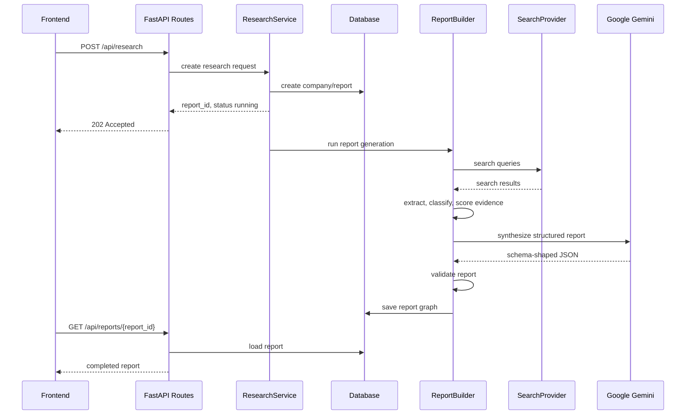

# Backend Architecture

## Purpose

This document defines the backend implementation structure for the company research agent.

The backend must implement the API contract, persist the database model, validate the report schema, and isolate external providers such as search APIs and Google Gemini behind testable interfaces.

Primary references:

- `docs/api-contract.md`
- `docs/database-model.md`
- `docs/report-schema.md`
- `AGENT.md`

## Recommended Runtime

- Python.
- FastAPI.
- Pydantic.
- SQLAlchemy or SQLModel.
- Alembic.
- SQLite for MVP.
- Google Gemini for LLM synthesis.
- Search provider behind an internal interface.
- pytest for tests.

## API Execution Strategy

Use an asynchronous report status flow.

Recommendation:

- `POST /api/research` should create a report record and return `202 Accepted`.
- The report starts as `pending` or `running`.
- The frontend polls `GET /api/reports/{report_id}` until the report is `completed` or `failed`.

Reason:

- Company research can be slow.
- Search providers and Google Gemini can add latency.
- Polling avoids brittle long HTTP requests.
- This design still allows a simple in-process background task for the MVP.

MVP implementation can use FastAPI `BackgroundTasks`. A later production version can replace this with a real job queue without changing the API contract.

## Suggested Folder Structure

```text
backend/
  app/
    main.py
    api/
      __init__.py
      errors.py
      routes.py
      schemas.py
    core/
      __init__.py
      config.py
      time.py
    db/
      __init__.py
      models.py
      repositories.py
      session.py
    domain/
      __init__.py
      companies.py
      cv.py
      reports.py
    research/
      __init__.py
      content_extractor.py
      evidence_classifier.py
      query_builder.py
      scoring.py
      search_provider.py
    llm/
      __init__.py
      gemini.py
      prompts.py
      synthesizer.py
    services/
      __init__.py
      report_builder.py
      research_service.py
      validation.py
    tests/
      test_api_research.py
      test_company_normalization.py
      test_cv.py
      test_report_validation.py
      test_scoring.py
```

## Module Responsibilities

### `app/main.py`

Creates the FastAPI application.

Responsibilities:

- configure app metadata;
- include API routes;
- configure exception handlers;
- create startup checks if needed.

Should not contain business logic.

### `app/api/routes.py`

Defines HTTP endpoints.

Responsibilities:

- `POST /api/research`;
- `GET /api/reports/{report_id}`;
- `GET /api/reports`;
- `GET /api/companies/{company_id}/reports`;
- `DELETE /api/reports/{report_id}/cv-data`.

Rules:

- Routes should validate request schemas.
- Routes should call services.
- Routes should not call Google Gemini or search providers directly.
- Routes should return response schemas from `app/api/schemas.py`.

### `app/api/schemas.py`

Defines API request and response schemas.

Responsibilities:

- request validation;
- response shapes from `docs/api-contract.md`;
- shared error response models.

Examples:

- `ResearchRequest`
- `ResearchAcceptedResponse`
- `ReportResponse`
- `ReportListResponse`
- `ErrorResponse`

### `app/api/errors.py`

Centralizes API errors.

Responsibilities:

- stable error codes;
- Spanish messages;
- exception-to-response mapping.

### `app/core/config.py`

Loads runtime configuration.

Expected settings:

- database URL;
- Google Gemini API key;
- Google Gemini model id;
- search provider name;
- search provider API key;
- report freshness days;
- CV text size limit;
- environment name.

Rules:

- Secrets must come from environment variables.
- Do not hardcode API keys.

### `app/db/models.py`

Defines ORM models matching `docs/database-model.md`.

Responsibilities:

- tables;
- relationships;
- indexes;
- enum-like string columns;
- JSON/text fields.

Rules:

- Keep model definitions boring and explicit.
- Do not embed report-generation logic in ORM models.

### `app/db/session.py`

Creates database engine and session dependency.

Responsibilities:

- database engine;
- session factory;
- FastAPI DB dependency.

### `app/db/repositories.py`

Persistence operations.

Responsibilities:

- create or get companies;
- create report records;
- update report status;
- save completed report graph;
- retrieve reports;
- list reports;
- delete CV-derived data.

Rules:

- Repository methods should not call external providers.
- Repository methods should enforce report ownership consistency, such as evidence belonging to the same report as claims.

### `app/domain/companies.py`

Company normalization and identity helpers.

Responsibilities:

- trim company names;
- normalize company names;
- validate company names;
- preserve possible aliases and ambiguity warnings.

### `app/domain/cv.py`

CV parsing and candidate signal extraction.

Responsibilities:

- validate CV text;
- extract candidate profile fields;
- support pasted text for MVP;
- later support PDF/DOCX extraction if requested.

Rules:

- Do not infer sensitive attributes.
- Prefer not to persist raw CV text.
- Keep tailoring separate from extraction.

### `app/domain/reports.py`

Domain-level report structures and constants.

Responsibilities:

- section order;
- enum constants;
- confidence levels;
- warning keys;
- report freshness rules.

### `app/research/query_builder.py`

Builds search queries.

Responsibilities:

- generate queries for official site;
- careers page;
- Argentina presence;
- employee count;
- salaries;
- culture;
- interview process;
- open roles.

Rules:

- Query generation must be deterministic and testable.

### `app/research/search_provider.py`

Search provider abstraction.

Recommended interface:

```python
class SearchProvider:
    def search(self, query: str, limit: int) -> list[SearchResult]:
        ...
```

Responsibilities:

- define provider-agnostic search result shape;
- implement provider-specific adapter later;
- provide fake provider for tests.

Rules:

- Do not leak provider-specific response formats into services.

### `app/research/content_extractor.py`

Fetches and extracts readable text from source pages.

Responsibilities:

- HTTP fetch;
- text extraction;
- snippet generation;
- content length limits.

Rules:

- Do not store full scraped pages.
- Extraction failures should create warnings, not crash the whole report unless all sources fail.

### `app/research/evidence_classifier.py`

Classifies evidence by topic.

Responsibilities:

- map snippets and extracted text to evidence topics;
- create normalized evidence claims;
- flag missing evidence.

MVP can use deterministic keyword/rule-based classification. More advanced classification can be added later.

### `app/research/scoring.py`

Scores source reliability and evidence confidence.

Responsibilities:

- classify source type;
- score source reliability from 1 to 5;
- score evidence confidence.

Rules:

- Scoring must be deterministic.
- Google Gemini must not decide source reliability.

### `app/llm/synthesizer.py`

Defines the LLM provider interface.

Recommended interface:

```python
class ReportSynthesizer:
    def synthesize(self, request: SynthesisRequest) -> StructuredReport:
        ...
```

Responsibilities:

- provider-agnostic synthesis contract;
- typed request and response objects;
- fake synthesizer for tests.

### `app/llm/gemini.py`

Google Gemini implementation.

Responsibilities:

- call Google Gemini API;
- pass structured evidence and source metadata;
- request schema-compatible JSON;
- handle provider errors;
- return parsed output for validation.

Rules:

- Google Gemini output must be validated before saving.
- Do not let Google Gemini invent sources.
- Do not treat LLM output as evidence.

### `app/llm/prompts.py`

Prompt templates.

Responsibilities:

- Spanish report synthesis prompt;
- CV preparation prompt;
- CV tailoring prompt;
- strict citation and truthfulness rules.

Rules:

- Prompts must instruct the model to use only provided evidence as factual context.
- Prompts must require `evidence_ids` for factual claims.
- CV tailoring prompts must forbid invented CV facts.

### `app/services/research_service.py`

Main orchestration service.

Responsibilities:

- accept research request;
- create or reuse company;
- create report record;
- enqueue or run generation;
- update report status.

Rules:

- This service coordinates work but should delegate actual steps.

### `app/services/report_builder.py`

Builds the completed report graph.

Responsibilities:

- run research pipeline;
- collect sources;
- extract evidence;
- extract CV profile when provided;
- generate personalized preparation when CV exists;
- generate CV tailoring when requested;
- call synthesizer;
- return a validated structured report.

### `app/services/validation.py`

Validates completed reports before saving.

Responsibilities:

- schema validation;
- same-report citation validation;
- factual claim evidence validation;
- source reliability range validation;
- Google Gemini metadata validation;
- CV tailoring safety checks.

Rules:

- Invalid reports must not be saved as `completed`.
- Invalid model output should produce a failed report or retry path.

## End-to-End Flow



## Provider Boundaries

External integrations must be replaceable.

Required interfaces:

- `SearchProvider`
- `ContentExtractor`
- `ReportSynthesizer`

Testing implementations:

- `FakeSearchProvider`
- `FakeContentExtractor`
- `FakeReportSynthesizer`

Production implementations:

- first chosen search provider adapter;
- HTTP content extractor;
- Google Gemini report synthesizer.

## Report Validation Flow

Before saving a completed report:

1. Validate Pydantic schema.
2. Validate every factual claim has evidence.
3. Validate every cited evidence id exists.
4. Validate every evidence item belongs to the same report.
5. Validate every evidence item references a source.
6. Validate source reliability scores are between 1 and 5.
7. Validate `metadata.llm_provider = "gemini"`.
8. Validate CV tailoring does not include `add_only_if_true` items in the adapted draft by default.
9. Validate API response does not expose raw CV text.

## Testing Strategy

### Unit Tests

Cover:

- company normalization;
- request validation;
- query generation;
- source scoring;
- evidence classification;
- CV signal extraction;
- CV tailoring validation;
- report schema validation.

### Service Tests

Use fake providers to test:

- report creation;
- status transitions;
- no-CV report generation;
- CV preparation generation;
- CV tailoring generation;
- failed search provider;
- failed Google Gemini provider;
- invalid model output.

### API Tests

Use FastAPI test client.

Cover:

- `POST /api/research` returns `202 Accepted`;
- invalid company name returns `400` or `422`;
- CV tailoring without CV returns `400`;
- `GET /api/reports/{report_id}` handles running/completed/failed;
- `GET /api/reports` returns summaries only;
- `DELETE /api/reports/{report_id}/cv-data` deletes CV-derived data.

## MVP Implementation Order

1. Create backend package structure.
2. Add Pydantic API schemas.
3. Add report schema Pydantic models.
4. Add SQLAlchemy/SQLModel models.
5. Add SQLite session setup.
6. Add repositories.
7. Add FastAPI routes with mocked generation.
8. Add fake report builder.
9. Add tests for API and persistence.
10. Add deterministic research pipeline.
11. Add Google Gemini synthesizer.
12. Add real search provider adapter.
13. Add CV extraction and tailoring.

## Explicit Non-Goals For Backend MVP

- No user accounts.
- No auth.
- No multi-tenant permissions.
- No scraping behind login.
- No scheduled report refreshes.
- No CV file uploads unless explicitly added.
- No DOCX/PDF export for adapted CV drafts unless explicitly added.

## Open Questions

- Which search provider should be implemented first?
- Should background generation use FastAPI `BackgroundTasks` for MVP?
- Should report generation failures be visible in the frontend history?
- Should raw CV text be discarded immediately after candidate profile extraction?

