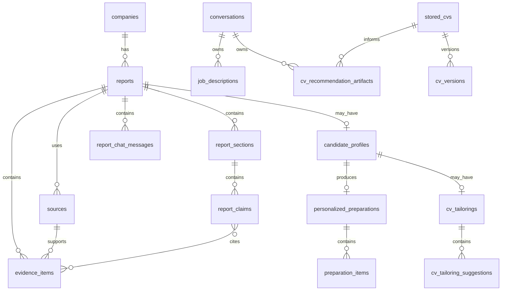

# Database Model

## Purpose

This document defines the MVP database model for the company research agent.

The database supports:

- saved company research reports;
- auditable sources and evidence;
- structured report sections and claims;
- optional CV-derived personalization;
- optional CV tailoring suggestions and adapted CV drafts;
- report-grounded chat messages;
- DeepSeek generation metadata and Google embedding metadata;
- future migration from SQLite to PostgreSQL.

Primary schema reference:

- `docs/report-schema.md`

## Database Choice

MVP:

- SQLite.

Future production:

- PostgreSQL.

The implementation uses SQLAlchemy with Alembic migrations so the storage layer can evolve without rewriting stored domain records.

The Phase 4 baseline represents the complete schema, including report/evidence, conversation/task, comparison, and persistent CV entities. Empty and versioned databases run `alembic upgrade head`. A matching unversioned database is backed up and stamped; incomplete, unexpected, or column-incompatible schemas fail without modification. Unit tests may continue using `Base.metadata.create_all()` only against isolated temporary databases.

## Modeling Principles

- Use relational tables for entities that need querying, filtering, or citation integrity.
- Use JSON columns only for flexible nested structures that do not need frequent filtering in the MVP.
- Keep source, evidence, section, and claim records separate so citations can be audited.
- Store report output as structured data, not only Markdown.
- Keep CV personalization optional.
- Keep CV tailoring optional and separate from the original CV.
- Avoid storing more raw personal data than needed.

## Entity Relationship Overview

## Tables

### Phase 3 Persistent CV Entities (Implemented)

`stored_cvs` stores display name, default selection, current version ID, and timestamps. `cv_versions` stores monotonic version number, generated managed-storage key, original filename/content type/size/SHA-256 when a binary exists, extracted text, structured signals, creation source, and source-version ID. Text edits have no binary and uploaded originals remain immutable.

`job_descriptions` stores conversation/message ownership, title, raw local text, deterministic signals, and creation time. Conversation deletion cascades to these rows.

`cv_recommendation_artifacts` stores the exact CV/version and optional job-description IDs, evidence-linked suggestions, editable draft, review decisions, status, and timestamps. Conversation or CV deletion removes owned/derived recommendation artifacts; deleting a conversation never deletes an attached stored CV.

Conversation artifact links refer to CVs, job descriptions, and recommendation artifacts by opaque ID without copying their raw content. Generated storage keys are resolved under `CV_STORAGE_DIR`; user-supplied absolute paths are never stored.

### `companies`

Stores normalized company identities.

Columns:

| Column | Type | Required | Notes |
| --- | --- | --- | --- |
| `id` | UUID/string | yes | Primary key. |
| `name` | text | yes | Display name. |
| `normalized_name` | text | yes | Lowercase normalized search key. |
| `possible_aliases_json` | JSON/text | no | List of aliases found during research. |
| `ambiguity_warning` | text | no | Spanish warning for ambiguous names. |
| `created_at` | datetime | yes | Creation timestamp. |
| `updated_at` | datetime | yes | Last update timestamp. |

Indexes:

- unique index on `normalized_name`;
- index on `name`.

Notes:

- `normalized_name` should be generated deterministically.
- Ambiguity should not block report generation unless the input is unusable.

### `reports`

Stores one generated report for a company.

Columns:

| Column | Type | Required | Notes |
| --- | --- | --- | --- |
| `id` | UUID/string | yes | Primary key. |
| `company_id` | UUID/string | yes | Foreign key to `companies.id`. |
| `schema_version` | text | yes | Example: `1.0`. |
| `status` | text | yes | `pending`, `running`, `completed`, `failed`. |
| `language` | text | yes | MVP value: `es-AR`. |
| `generated_at` | datetime | no | Set when completed. |
| `valid_until` | datetime | no | Suggested report freshness window. |
| `summary` | text | no | Executive summary for quick listing. |
| `warnings_json` | JSON/text | yes | Report-level warning objects. |
| `metadata_json` | JSON/text | yes | Search provider, DeepSeek model, counts, timings. |
| `error_message` | text | no | Spanish or developer-readable failure message. |
| `created_at` | datetime | yes | Creation timestamp. |
| `updated_at` | datetime | yes | Last update timestamp. |

Indexes:

- index on `company_id`;
- index on `status`;
- index on `generated_at`;
- compound index on `company_id`, `generated_at`.

Rules:

- A completed report must have `generated_at`.
- Failed reports should keep enough metadata to debug the failure.
- Reports should be immutable after completion except for explicit maintenance fields.
- Deleting a report should delete its sections, claims, evidence, sources, CV-derived data, and chat messages. If the company has no remaining reports, the company record may also be deleted.

### `report_chat_messages`

Stores saved chat exchanges grounded in one completed report.

Columns:

| Column | Type | Required | Notes |
| --- | --- | --- | --- |
| `id` | UUID/string | yes | Primary key. |
| `report_id` | UUID/string | yes | Foreign key to `reports.id`. |
| `role` | text | yes | `user` or `assistant`. |
| `content` | text | yes | Spanish chat message or answer. |
| `citations_json` | JSON/text | yes | Assistant citation objects; empty list for user messages. |
| `created_at` | datetime | yes | Creation timestamp. |

Rules:

- Chat answers must be grounded in the saved report context.
- Raw CV files must not be stored in chat records.

### `report_embedding_chunks`

Stores local SQLite vector-search chunks for RAG over completed reports.

Columns:

| Column | Type | Required | Notes |
| --- | --- | --- | --- |
| `id` | UUID/string | yes | Primary key. |
| `report_id` | UUID/string | yes | Foreign key to `reports.id`; deleted with the report. |
| `company_id` | UUID/string | yes | Foreign key to `companies.id`. |
| `chunk_key` | text | yes | Stable key unique per report. |
| `chunk_type` | text | yes | Section, evidence, or warning chunk type. |
| `chunk_title` | text | yes | Human-readable title for citations. |
| `chunk_text` | text | yes | Embedded text. Must not include raw CV text. |
| `source_ids_json` | JSON/text | yes | Source ids used for citations. |
| `evidence_ids_json` | JSON/text | yes | Evidence ids represented by the chunk. |
| `embedding_provider` | text | yes | `google`. |
| `embedding_model` | text | yes | Default `gemini-embedding-2`. |
| `embedding_dimensions` | integer | yes | Default `768`. |
| `embedding_json` | JSON/text | yes | Local vector stored as a float array. |
| `created_at` | datetime | yes | Creation timestamp. |

### `global_chat_messages`

Stores unified chatbot history when answers may use multiple reports.

Columns:

| Column | Type | Required | Notes |
| --- | --- | --- | --- |
| `id` | UUID/string | yes | Primary key. |
| `role` | text | yes | `user` or `assistant`. |
| `content` | text | yes | Spanish chat message or answer. |
| `scope_used` | text | no | `active_report` or `all_reports`. |
| `active_report_id` | UUID/string | no | Active report at question time. |
| `cited_report_ids_json` | JSON/text | yes | Reports cited by assistant answer. |
| `citations_json` | JSON/text | yes | Renderable citation objects. |
| `created_at` | datetime | yes | Creation timestamp. |

### `report_sections`

Stores structured report sections.

Columns:

| Column | Type | Required | Notes |
| --- | --- | --- | --- |
| `id` | UUID/string | yes | Primary key. |
| `report_id` | UUID/string | yes | Foreign key to `reports.id`. |
| `section_type` | text | yes | Section type enum from report schema. |
| `title` | text | yes | Spanish UI title. |
| `summary` | text | yes | Spanish section summary. |
| `confidence` | text | yes | `high`, `medium`, `low`, `unknown`. |
| `missing_evidence` | boolean | yes | True when support is insufficient. |
| `display_order` | integer | yes | UI ordering. |
| `created_at` | datetime | yes | Creation timestamp. |

Indexes:

- index on `report_id`;
- compound unique index on `report_id`, `section_type`.

Rules:

- Each report should have at most one section per `section_type`.
- Sections should not duplicate source lists; source details belong in `sources`.

### `report_claims`

Stores section-level claims.

Columns:

| Column | Type | Required | Notes |
| --- | --- | --- | --- |
| `id` | UUID/string | yes | Primary key. |
| `section_id` | UUID/string | yes | Foreign key to `report_sections.id`. |
| `claim_type` | text | yes | `fact`, `inference`, `recommendation`, `missing_evidence`. |
| `text` | text | yes | Spanish user-facing claim. |
| `confidence` | text | yes | Claim confidence. |
| `display_order` | integer | yes | UI ordering. |
| `created_at` | datetime | yes | Creation timestamp. |

Indexes:

- index on `section_id`;
- index on `claim_type`.

Rules:

- `fact` claims should cite at least one evidence item through `claim_evidence`.
- `missing_evidence` claims should not need evidence.

### `sources`

Stores retained source metadata.

Columns:

| Column | Type | Required | Notes |
| --- | --- | --- | --- |
| `id` | UUID/string | yes | Primary key. |
| `report_id` | UUID/string | yes | Foreign key to `reports.id`. |
| `title` | text | yes | Source title. |
| `url` | text | yes | Canonical URL. |
| `domain` | text | yes | Parsed domain. |
| `source_type` | text | yes | Source type enum. |
| `reliability_score` | integer | yes | 1 to 5. |
| `accessed_at` | datetime | yes | Fetch timestamp. |
| `published_at` | datetime | no | Publication date if found. |
| `snippet` | text | no | Short extracted snippet. |
| `language` | text | no | Source language if detected. |
| `is_current` | boolean | yes | Whether source is current enough. |
| `created_at` | datetime | yes | Creation timestamp. |

Indexes:

- index on `report_id`;
- index on `domain`;
- index on `source_type`;
- compound unique index on `report_id`, `url`.

Rules:

- Do not store full scraped pages in this table.
- `reliability_score` must be deterministic and testable.

### `evidence_items`

Stores evidence extracted from sources.

Columns:

| Column | Type | Required | Notes |
| --- | --- | --- | --- |
| `id` | UUID/string | yes | Primary key. |
| `report_id` | UUID/string | yes | Foreign key to `reports.id`. |
| `source_id` | UUID/string | yes | Foreign key to `sources.id`. |
| `topic` | text | yes | Evidence topic enum. |
| `claim` | text | yes | Normalized Spanish evidence claim. |
| `raw_text_excerpt` | text | no | Short supporting excerpt. |
| `confidence` | text | yes | Evidence confidence. |
| `created_at` | datetime | yes | Creation timestamp. |

Indexes:

- index on `report_id`;
- index on `source_id`;
- index on `topic`.

Rules:

- Each evidence item must link to exactly one source.
- Evidence excerpts must be short and auditable.
- Do not store full scraped pages.

### `claim_evidence`

Join table linking claims to supporting evidence.

Columns:

| Column | Type | Required | Notes |
| --- | --- | --- | --- |
| `claim_id` | UUID/string | yes | Foreign key to `report_claims.id`. |
| `evidence_id` | UUID/string | yes | Foreign key to `evidence_items.id`. |
| `created_at` | datetime | yes | Creation timestamp. |

Indexes:

- primary key or unique index on `claim_id`, `evidence_id`;
- index on `evidence_id`.

Rules:

- This table is required for auditable citations.
- A factual claim without related evidence should fail validation unless it is explicitly represented as missing evidence.

### `candidate_profiles`

Stores optional structured CV extraction for a report.

Columns:

| Column | Type | Required | Notes |
| --- | --- | --- | --- |
| `id` | UUID/string | yes | Primary key. |
| `report_id` | UUID/string | yes | Foreign key to `reports.id`. |
| `raw_cv_text` | text | no | Optional raw CV text. See privacy note. |
| `roles_json` | JSON/text | yes | Extracted roles. |
| `seniority` | text | no | Extracted seniority if present. |
| `industries_json` | JSON/text | yes | Extracted industries. |
| `hard_skills_json` | JSON/text | yes | Extracted hard skills. |
| `soft_skills_json` | JSON/text | yes | Extracted soft skills. |
| `tools_json` | JSON/text | yes | Extracted tools. |
| `education_json` | JSON/text | yes | Extracted education. |
| `languages_json` | JSON/text | yes | Extracted languages. |
| `achievements_json` | JSON/text | yes | Extracted achievements. |
| `confidence` | text | yes | Extraction confidence. |
| `created_at` | datetime | yes | Creation timestamp. |

Indexes:

- unique index on `report_id`.

Privacy rule:

- Prefer not to store `raw_cv_text` long term. For MVP development, if it is stored, keep the field nullable and make deletion easy.

### `personalized_preparations`

Stores optional CV-to-company fit output.

Columns:

| Column | Type | Required | Notes |
| --- | --- | --- | --- |
| `id` | UUID/string | yes | Primary key. |
| `candidate_profile_id` | UUID/string | yes | Foreign key to `candidate_profiles.id`. |
| `fit_summary` | text | yes | Spanish fit summary. |
| `fit_confidence` | text | yes | Confidence level. |
| `suggested_pitch` | text | no | Spanish tailored pitch. |
| `warnings_json` | JSON/text | yes | Personalization warnings. |
| `created_at` | datetime | yes | Creation timestamp. |

Indexes:

- unique index on `candidate_profile_id`.

Rules:

- Must avoid definitive fit/no-fit judgments.
- Must include caveats when company evidence or CV detail is weak.

### `preparation_items`

Stores individual personalized preparation items.

Columns:

| Column | Type | Required | Notes |
| --- | --- | --- | --- |
| `id` | UUID/string | yes | Primary key. |
| `personalized_preparation_id` | UUID/string | yes | Foreign key to `personalized_preparations.id`. |
| `item_type` | text | yes | `strength`, `gap`, `question`, `question_for_company`, `star_outline`. |
| `text` | text | yes | Spanish item text. |
| `reason` | text | no | Explanation for the recommendation. |
| `confidence` | text | yes | Confidence level. |
| `payload_json` | JSON/text | no | STAR outline fields or other structured details. |
| `display_order` | integer | yes | UI ordering. |
| `created_at` | datetime | yes | Creation timestamp. |

Indexes:

- index on `personalized_preparation_id`;
- index on `item_type`.

Rules:

- Use `payload_json` for STAR outlines instead of adding many sparse columns.
- Keep all user-facing text in Spanish.

### `cv_tailorings`

Stores optional CV tailoring output for a report.

Columns:

| Column | Type | Required | Notes |
| --- | --- | --- | --- |
| `id` | UUID/string | yes | Primary key. |
| `candidate_profile_id` | UUID/string | yes | Foreign key to `candidate_profiles.id`. |
| `positioning_summary` | text | yes | Spanish tailoring focus. |
| `adapted_cv_draft_markdown` | text | no | Optional adapted CV draft. |
| `warnings_json` | JSON/text | yes | Tailoring warnings. |
| `created_at` | datetime | yes | Creation timestamp. |

Indexes:

- unique index on `candidate_profile_id`.

Rules:

- Must not overwrite the original CV.
- Must not invent experience, employers, education, tools, metrics, or dates.
- Must keep the adapted draft separate from raw CV text.

### `cv_tailoring_suggestions`

Stores individual CV tailoring suggestions.

Columns:

| Column | Type | Required | Notes |
| --- | --- | --- | --- |
| `id` | UUID/string | yes | Primary key. |
| `cv_tailoring_id` | UUID/string | yes | Foreign key to `cv_tailorings.id`. |
| `suggestion_type` | text | yes | `rewrite`, `reorder`, `emphasize`, `add_only_if_true`. |
| `original_text` | text | no | Original CV fragment. |
| `suggested_text` | text | yes | Suggested Spanish text. |
| `reason` | text | yes | Why the suggestion helps. |
| `evidence_ids_json` | JSON/text | yes | Evidence ids supporting company/job relevance. |
| `requires_user_confirmation` | boolean | yes | True when the suggestion needs user confirmation. |
| `confidence` | text | yes | Confidence level. |
| `included_in_draft` | boolean | yes | Whether the adapted draft includes this suggestion. |
| `display_order` | integer | yes | UI ordering. |
| `created_at` | datetime | yes | Creation timestamp. |

Indexes:

- index on `cv_tailoring_id`;
- index on `suggestion_type`.

Rules:

- `add_only_if_true` suggestions must set `requires_user_confirmation = true`.
- `add_only_if_true` suggestions must not be included in the draft by default.
- Suggestions based on researched company/job context should reference evidence ids.

## JSON Column Conventions

SQLite stores JSON as text; PostgreSQL can use JSONB later.

JSON/text fields must default to valid empty structures:

- arrays as `[]`;
- objects as `{}`.

Do not store arbitrary unvalidated model output. Validate JSON against Pydantic schemas before persistence.

## Freshness and Caching

Reports may be reused while `valid_until` is in the future unless the request uses `force_refresh`.

Suggested MVP freshness:

- general company overview: 30 days;
- open roles: 7 days;
- salary and culture: 30 to 90 days depending on source dates.

If freshness differs by section, store the conservative report-level `valid_until` and add warnings for stale sections.

## Validation Rules Before Save

Before a report can be marked `completed`:

- `reports.status` must be `completed`;
- at least one `report_sections` row must exist;
- all sections must have Spanish `title` and `summary`;
- every `fact` claim must have at least one `claim_evidence` row;
- every `claim_evidence.evidence_id` must belong to the same report as the claim;
- every evidence item must reference a valid source;
- source reliability scores must be between 1 and 5;
- metadata must include `llm_provider = "deepseek"` for newly generated reports;
- if a CV was provided, `candidate_profiles` must exist and personalization must either exist or include a clear warning.
- if CV tailoring was requested, `cv_tailorings` must exist and suggestions must preserve original CV facts.

## Deletion and Privacy

MVP has no user accounts, but CV text can be sensitive.

Rules:

- Keep `raw_cv_text` nullable.
- Prefer storing extracted CV signals over raw text.
- Make it possible to delete `candidate_profiles` and `personalized_preparations` for a report.
- Make it possible to delete `cv_tailorings` and `cv_tailoring_suggestions` for a report.
- Do not log raw CV text.
- Do not send raw CV text to services other than the configured LLM provider without explicit design approval.

## Migration Notes

The baseline Alembic revision represents:

1. `companies`
2. `reports`
3. `report_sections`
4. `report_claims`
5. `sources`
6. `evidence_items`
7. `claim_evidence`
8. `candidate_profiles`
9. `personalized_preparations`
10. `preparation_items`
11. `cv_tailorings`
12. `cv_tailoring_suggestions`
13. report chat and embedding records;
14. conversations, messages, artifact links, task runs, and ordered task events;
15. comparison artifacts;
16. stored CVs, CV versions, job descriptions, and CV recommendation artifacts.

Use string UUIDs for SQLite compatibility.

SQLite connections enable foreign-key enforcement and a five-second busy timeout. Migration adoption and upgrades never delete existing reports, conversations, CV files, embeddings, or historical provider metadata.

When moving to PostgreSQL:

- convert JSON/text columns to JSONB where useful;
- keep UUIDs as native UUID if desired;
- add full-text indexes only if search over saved reports becomes necessary.

## Open Questions

- Should raw CV text be persisted by default, or discarded after extracting signals?
- Which search provider will be used first?
- How long should reports stay valid by default?
- Should failed reports be visible in report history or only used for debugging?
- Should adapted CV drafts be exportable as DOCX/PDF in the MVP or only rendered in the UI?

